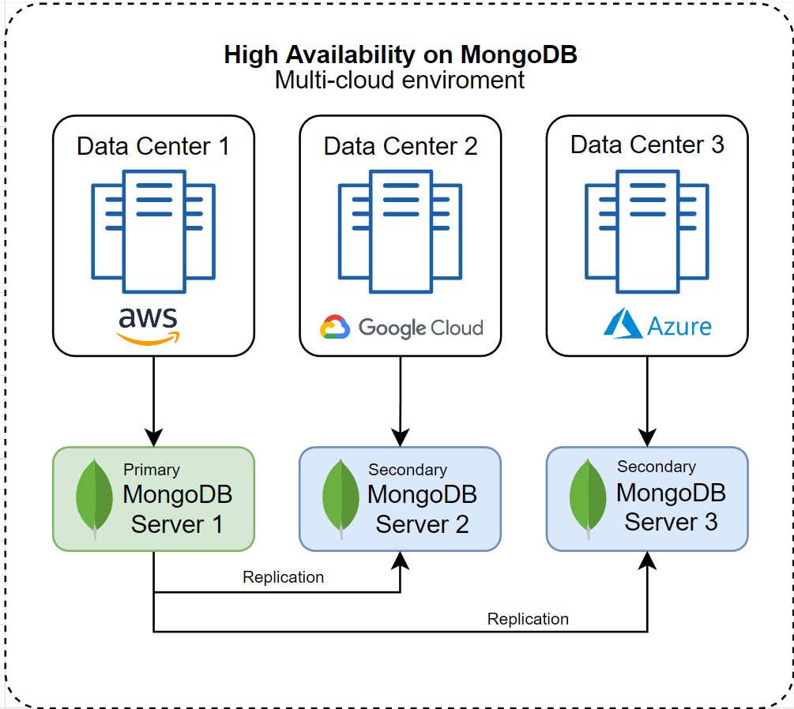

# RestApiCpp Documentation

This documentation covers the set up an environment with MongoDB C/C++ drivers, Crow (a micro web framework), and Boost libraries.

## **Table of Content**

* [**Architecture of TodoApplication**](#architecture-of-todoapplication)
* [**Boost Framework**](#boost-framework)
* [**Crow Framework**](#crow-framework)
* [**CMake**](#cmake)
* [**Create Source files**](#create-source-files)
* [**Setup MongoDB database**](#setup-mongodb-database)
* [**Essential Packages on Ubuntu**](#essential-packages-on-ubuntu)
* [**MongoDB C Driver**](#mongodb-c-driver)
* [**MongoDB C++ Driver**](#mongodb-c++-driver)
* [**Extract Crow Framework**](#extract-crow-framework)
* [**Extract Boost Libraries**](#extract-boost-libraries)
* [**Build the Application**](#build-the-application)
* [**Run the Application**](#run-the-application)

## **Architecture of TodoApplication**


{{1}}


{{2}}


{{3}}


## **Boost Framework**

Boost C++ Libraries, often referred to simply as Boost, is a collection of peer-reviewed, portable, and high-quality libraries that augment and complement the C++ Standard Library. These libraries facilitate tasks ranging from low-level programming chores to high-level, domain-specific operations.

**Why we need Boost:**

* **Filling Gaps**: Boost provides functionalities that might be missing from the C++ Standard Library, offering a more comprehensive set of tools for developers.

* **Rapid Prototyping**: Given its wide range of utilities and algorithms, Boost can speed up the development process, allowing for faster prototyping and development.

* **High Quality**: Boost libraries undergo rigorous peer review, ensuring they meet high standards of design, performance, and reliability.

* **Portability**: Boost is designed to be cross-platform and works across various compilers, ensuring that code written using Boost libraries remains portable.

* **Influence on C++ Standard**: Many features originally developed in Boost have made their way into the C++ Standard Library. Using Boost can, in a way, provide developers with a glimpse into future C++ standards and practices.

* **Advanced Features**: Boost offers advanced libraries for tasks like asynchronous I/O (Boost.Asio), multi-threading, and even metaprogramming, which can significantly enhance a C++ application's capabilities.

* **Consistency**: By providing a consistent interface across its libraries, Boost makes it easier for developers to learn and use different parts of the collection.

**Reference**:

* https://www.boost.org/users/

## **Crow Framework**

Crow is a fast, lightweight, and easy-to-use C++ micro web framework (similar in spirit to Flask for Python or Sinatra for Ruby). It's designed for creating web services with a minimal amount of code and overhead. Here are some of the characteristics and features of Crow:

* **Header-only**: Crow is primarily distributed as a header-only library, which means you don't need to compile it separately; including the header files in your project is typically sufficient.

* **Fast**: Crow is optimized for performance and can handle a large number of requests with minimal overhead.

* **Simple to Use**: With Crow, setting up a basic web server can be done with just a few lines of code.

* **Middleware Support**: Crow allows you to use middleware components that can process requests or modify responses. This is useful for functionalities like logging, error handling, or authentication.

* **JSON Support**: Crow has built-in support for JSON, making it easy to create RESTful APIs.

* **WebSockets**: Crow also has basic support for WebSockets, enabling real-time communication between the server and the client.

* **Route-based Request Handling**: Define handlers for specific routes and HTTP methods. For example, you can easily set up a handler to process GET requests for a specific URL path.

<br>

`Crow` is built on top of the `Boost` libraries, particularly the Boost.Asio library. Here's how Crow is interconnected with Boost:

* **Boost.Asio for Networking:** Boost.Asio provides a scalable and efficient asynchronous I/O framework that's suitable for building network applications. Crow uses Boost.Asio to handle all the low-level networking tasks, such as managing sockets, handling incoming connections, and processing HTTP requests asynchronously. By leveraging Boost.Asio, Crow can handle multiple concurrent connections with efficient use of resources.

* **Boost for Multi-threading:** Crow uses Boost's threading libraries to manage threads in its server. This allows Crow to handle multiple requests concurrently, improving the throughput of the server.

* **Boost for Utilities:** Crow also takes advantage of various other Boost utilities and data structures to manage its internal workings. This includes things like containers, algorithms, and smart pointers.

* **Headers and Dependencies:** Because Crow is built on Boost, if you inspect Crow's header files, you'll often see Boost headers being included and Boost types being used throughout the code.

* **Maturity and Stability:** By building on top of Boost, Crow can benefit from the maturity, stability, and performance of Boost libraries. Boost is one of the most widely used C++ libraries, with a long history of rigorous testing and development.

**Reference**:

* https://crowcpp.org/master/

## **CMake**

CMake is an `open-source`, `cross-platform` family of tools designed to build, test, and package software. It controls the software compilation process using simple, platform- and compiler-independent configuration files. CMake generates native makefiles and workspaces tailored for the compiler environment of the user's choice.

**Why we need CMake:**

* **Cross-Platform Compatibility**: One of the primary reasons for using CMake is its ability to work across different platforms, from Windows to macOS to various flavors of Linux and more. Write once, compile anywhere.

* **Out-of-Source Builds**: CMake supports building projects outside of the source directory. This keeps build artifacts separate from the source code, maintaining a clean project directory.

* **Generates Native Build Systems**: CMake isn't a compiler or a direct build system. Instead, it generates files for various build systems, such as UNIX Makefiles, Visual Studio project files, Xcode projects, and more. This flexibility allows developers to use their preferred tools.

* **Modularity and Scripting**: CMakeLists.txt files can be arranged in a hierarchical manner, making it possible to manage even large-scale projects with multiple subcomponents. CMake's scripting capabilities also allow for advanced configurations and build processes.

* **Customizable Build Configurations**: With CMake, developers can easily set up different build configurations, like Debug, Release, or RelWithDebInfo, tailoring the build process to different needs.

* **Find Packages Easily**: CMake includes a mechanism to find libraries and packages that are installed on a system, making it simpler to include and link against them. This reduces the hassle of manually setting include paths and library paths.

* **Toolchain Files for Cross-Compilation**: CMake supports cross-compilation through the use of toolchain files. These files define the tools (compilers, linkers, etc.) to be used, making it easier to compile software for different targets from a single machine.

* **Continuous Integration & Testing**: With the help of the CTest tool bundled with CMake, it's easier to integrate testing directly into the build process, facilitating continuous integration workflows.

* **Community and Ecosystem**: Given its popularity, there's a strong community around CMake, offering modules, scripts, and tools that extend its functionality.

## Create Source files

* [**main.cpp**](#main.cpp)
* [**Methods.h**](#methods.h)
* [**CMakeLists.txt**](#cmakelists.txt)

### **main.cpp**

```c
#include "Methods.h"

// ********************************************** Main **********************************************
int main()
{
	crow::SimpleApp app; //define your crow application
	set_global_base("."); //search for the files in current dir.
	mongocxx::instance inst{};
	string mongoConnect = std::string("your-mongodb-uri");
	mongocxx::client conn{ mongocxx::uri{mongoConnect} };
	auto collection = conn["TodoRecords"]["TodoCollection"];//get collection from database

	//API endpoint to read all todos
	CROW_ROUTE(app, "/api/todo")
		([&collection](const request& req) {
		mongocxx::options::find opts;
		auto docs = collection.find({}, opts);
		vector<crow::json::rvalue> todo;

		for (auto doc : docs) {
			todo.push_back(json::load(bsoncxx::to_json(doc)));
		}
		crow::json::wvalue dto;
		dto["todos"] = todo;
		return crow::response{ dto };
			});

	//API endpoint to insert todo from the given json body
	CROW_ROUTE(app, "/api/todo/add").methods(HTTPMethod::POST)
		([&collection](const request& req) {
		crow::json::rvalue request_body = json::load(req.body);

		// List of required keys
		std::vector<std::string> required_keys = { "Id", "firstName", "lastName", "emailId", "location" };

		// Check if all required keys exist in the request body
		for (const auto& key : required_keys) {
			if (!request_body.has(key)) {
				return crow::response(400, "Required key '" + key + "' missing in request body");
			}
		}

		// Check if the ID is already in the database
		bool id_already_present = findTodoRecord(collection, std::string(request_body["Id"]));

		if (!id_already_present) {
			// ID is not present, so insert the new record
			insertTodo(collection, createTodo({
				{"Id", std::string(request_body["Id"])},
				{"firstName", std::string(request_body["firstName"])},
				{"lastName", std::string(request_body["lastName"])},
				{"emailId", std::string(request_body["emailId"])},
				{"location", std::string(request_body["location"])},
				}));
			return crow::response(200, "Todo Added Successfully!!");
		}
		else {
			// ID is already present
			return crow::response(400, "ID already present in the database");
		}
			});

	//set the port, set the app to run on multiple threads, and run the app
	app.bindaddr("127.0.0.1").port(8080).multithreaded().run();

}
```

**Setting up the Crow Server and MongoDB**

**1. Include Required Headers**: 

```cpp
#include "Methods.h"
```

The necessary header, "Methods.h".

**2. Initialize Crow Application**:

```cpp
crow::SimpleApp app; //define your crow application
```

This line initializes a Crow application, which is needed to set up routes and start the server later.


**3. Set Global Base Directory**:

```cpp
set_global_base("."); //search for the files in current dir.
```

This sets the current directory as the base directory for the application.

**4. Initialize MongoDB**:

```cpp
mongocxx::instance inst{};
string mongoConnect = std::string("your-mongodb-uri");
mongocxx::client conn{ mongocxx::uri{mongoConnect} };
auto collection = conn["TodoRecords"]["TodoCollection"];
```

* A new instance of MongoDB is initialized.
* The MongoDB URI (connection string) is set (replace "your-mongodb-uri" with the actual MongoDB URI).
* A MongoDB client is created to connect to the database.
* A specific collection (`TodoCollection`) within the `TodoRecords` database is accessed.

**API Endpoints**

**5. Endpoint to Retrieve All Todos**:

```cpp
CROW_ROUTE(app, "/api/todo")
```

This sets up a GET endpoint at "/api/todo". When accessed:

* It queries the `TodoCollection` to retrieve all records.
* Each document fetched from the database is converted from BSON to JSON.
* All the todos are collected into a vector and sent back as a JSON response.

6. **Endpoint to Add a Todo**:

```cpp
CROW_ROUTE(app, "/api/todo/add").methods(HTTPMethod::POST)
```

This sets up a POST endpoint at "/api/todo/add". When accessed:

* It first parses the incoming request to get the body in JSON format.
* The code then checks if the request has all the required fields (`Id`, `firstName`, `lastName`, `emailId`, and `location`).
* It verifies if a todo with the same `Id` already exists in the database.
* If not, it adds the new todo to the `TodoCollection` in MongoDB.
* Appropriate success or error responses are sent based on the operation's result.

**Running the Crow Application**

**7. Configure and Run the Crow Server**:

```cpp
app.bindaddr("127.0.0.1").port(8080).multithreaded().run();
```

* The application binds to IP address "127.0.0.1".
* It listens on port 8080.
* The `multithreaded()` method allows the server to handle multiple requests concurrently.
* Finally, the `run()` method starts the Crow server.


### **Methods.h**

```c
#pragma once
#include <mongocxx/client.hpp>
#include <bsoncxx/builder/stream/document.hpp>
#include <bsoncxx/json.hpp>
#include <mongocxx/uri.hpp>
#include <mongocxx/instance.hpp>
#include <algorithm>
#include <iostream>
#include <vector>
#include "crow.h"
using namespace std;
using namespace crow;
using namespace crow::mustache;
using bsoncxx::builder::basic::kvp;
using bsoncxx::builder::basic::make_document;

// Create a todo from the given key-value pairs.
bsoncxx::document::value createTodo(const vector<pair<string, string>>& keyValues)
{
	bsoncxx::builder::stream::document document{};
	for (auto& keyValue : keyValues)
	{
		document << keyValue.first << keyValue.second;
	}
	return document << bsoncxx::builder::stream::finalize;
}

// Add the todo to the given collection.
void insertTodo(mongocxx::collection& collection, const bsoncxx::document::value& document)
{
	collection.insert_one(document.view());
}

// Find a todo from the given key-value pairs and return true if found.
bool findTodo(mongocxx::collection& collection, const string& key, const string& value)
{
	// Create the query filter
	auto filter = bsoncxx::builder::stream::document{} << key << value << bsoncxx::builder::stream::finalize;
	//Add query filter argument in find
	auto cursor = collection.find({ filter });
	auto count = std::distance(cursor.begin(), cursor.end());
	if (count != 0L) {
		return true;
	}
	return false;
}

//Pass the given collection and key-value pairs.
bool findTodoRecord(mongocxx::collection& collection, const string& id)
{
	return findTodo(collection, "Id", id);
}
```

**1. Including Necessary Headers:**

The code begins by including various necessary headers:

```cpp
#include <mongocxx/client.hpp>
#include <bsoncxx/builder/stream/document.hpp>
#include <bsoncxx/json.hpp>
...
```

These headers are from the MongoDB C++ driver and are essential for connecting to MongoDB, constructing BSON (binary JSON, which is used by MongoDB for storing data) documents, and more.

**2. Namespace Declarations:**

For ease of use and readability, several namespaces are imported:

```cpp
using namespace std;
using namespace crow;
using namespace crow::mustache;
...
```

**3. Function: `createTodo`**

```cpp
bsoncxx::document::value createTodo(const vector<pair<string, string>>& keyValues)
```

**Purpose**: This function takes a vector of key-value pairs and constructs a BSON document out of them.

**How It Works**:

* A new BSON document builder is initialized.
* The function loops through the provided key-value pairs, and for each pair, it adds an entry to the BSON document.
* The final document is returned.

**4. Function: `insertTodo`**

```cpp
void insertTodo(mongocxx::collection& collection, const bsoncxx::document::value& document)
```

**Purpose**: This function inserts a BSON document (a todo) into a specified MongoDB collection.
  
**How It Works**:

* The `insert_one` method of the provided MongoDB collection is called with the BSON document as its argument.

**5. Function: `findTodo`**

```cpp
bool findTodo(mongocxx::collection& collection, const string& key, const string& value)
```

**Purpose**: This function searches a MongoDB collection for a document that matches a specific key-value pair.
  
**How It Works**:

* A query filter is constructed using the provided key and value.
* The `find` method of the collection is called with the filter.
* The function checks the number of returned documents. If at least one document is found, it returns `true`, otherwise, it returns `false`.

**6. Function: `findTodoRecord`**

```cpp
bool findTodoRecord(mongocxx::collection& collection, const string& id)
```

**Purpose**: This function is a more specific version of the `findTodo` function. It searches for a todo in a collection based on its `Id`.
  
**How It Works**:

* It calls the `findTodo` function with "Id" as the key and the provided `id` as the value.


### **CMakeLists.txt**

```c
cmake_minimum_required(VERSION 3.15)
project(restapicpp)

# Define the include directories
set(INCLUDE_PATHS /app/boost_1_83_0 /app/crow/include)

# Add the executable target
add_executable(restapicpp main.cpp)

# Include the defined paths
target_include_directories(restapicpp PUBLIC ${INCLUDE_PATHS})

# MongoDB C++ driver includes and links
# The Dockerfile does not provide the exact paths, but often, the drivers get installed to /usr/local
set(MONGOCXX_LIBS /usr/local/lib)
set(MONGOCXX_INCLUDE /usr/local/include/mongocxx/v_noabi)
set(BSONCXX_INCLUDE /usr/local/include/bsoncxx/v_noabi)

target_include_directories(restapicpp PRIVATE ${MONGOCXX_INCLUDE} ${BSONCXX_INCLUDE})
target_link_libraries(restapicpp PRIVATE 
    ${MONGOCXX_LIBS}/libmongocxx.so
    ${MONGOCXX_LIBS}/libbsoncxx.so
)

# Specify the C++ standard
set_target_properties(restapicpp PROPERTIES
    CXX_STANDARD 17
    CXX_STANDARD_REQUIRED TRUE
)
```

**1. Minimum CMake Version Requirement:**

```cmake
cmake_minimum_required(VERSION 3.15)
```

This line specifies that the minimum version of CMake required to build this project is 3.15.

**2. Project Name:**

```cmake
project(restapicpp)
```

The project is named `restapicpp`.

**3. Define Include Directories:**

```cmake
set(INCLUDE_PATHS /app/boost_1_83_0 /app/crow/include)
```

The Boost library and Crow header files are expected to be found in the specified directories.

**4. Add Executable Target:**

```cmake
add_executable(restapicpp main.cpp)
```

This line defines an executable named `restapicpp` that will be built from the source file `main.cpp`.

**5. Set Include Directories for the Target:**

```cmake
target_include_directories(restapicpp PUBLIC ${INCLUDE_PATHS})
```

The Boost and Crow include directories are added to the `restapicpp` target.

**6. Define MongoDB C++ Driver Paths:**

These lines hint where the MongoDB C++ driver and its BSON counterpart can be found.

```cmake
set(MONGOCXX_LIBS /usr/local/lib)
set(MONGOCXX_INCLUDE /usr/local/include/mongocxx/v_noabi)
set(BSONCXX_INCLUDE /usr/local/include/bsoncxx/v_noabi)
```

**7. Link MongoDB Libraries to the Target:**

```cmake
target_include_directories(restapicpp PRIVATE ${MONGOCXX_INCLUDE} ${BSONCXX_INCLUDE})
target_link_libraries(restapicpp PRIVATE 
    ${MONGOCXX_LIBS}/libmongocxx.so
    ${MONGOCXX_LIBS}/libbsoncxx.so
)
```

The MongoDB C++ driver headers are added, and the necessary shared libraries (`libmongocxx.so` and `libbsoncxx.so`) are linked to the `restapicpp` target.

**8. Specify the C++ Standard:**

```cmake
set_target_properties(restapicpp PROPERTIES
    CXX_STANDARD 17
    CXX_STANDARD_REQUIRED TRUE
)
```

The project will be compiled with C++17, and this standard is required. If the compiler does not support C++17, a configuration error will occur.

## **Setup MongoDB database**

**1. Sign in to MongoDB Atlas**

* If you already have a MongoDB Atlas account, navigate to the [MongoDB Atlas login page](https://account.mongodb.com/account/login) and enter your credentials.
* If you don't have an account, you'll need to create one. Click on "Signup" and provide the required details.
* After clicking on signup you will be sent email confirmation after confirmation you login into mongodb atlas.

**2. Choose the Free Version**

* After logging in (or signing up and logging in), you'll be presented with an option to build a new deployment. Choose the "Free" tier, which is known as the M0 Sandbox tier. This tier will provide you with 512 MB of storage and is suitable for small-scale development.
* Choose the cloud provider and region that's most suitable for you. Some options might be grayed out, as they're not available for the free tier.

**3. Setup Cluster**

* Once you've chosen the free version, MongoDB Atlas will begin setting up your cluster. This process may take a few minutes.

**4. Create Database User**

* Fill in the desired username and password for this user. Be sure to note this password, as you will need it later.
* Enable access for any network(s) that need to read and write data to your cluster.(My Local Environment)
* Set entries to your IP Access List (0.0.0.0)
* Finish and close

**5. Create Database & Collection**

* From the Data Service dashboard, click on the "Database" button.
* Then, click on the "Browse Collections" button.
* click "Add My Own Data" button that will navigate to create database.
* Name the database "TodoRecords".
* Name the collection "TodoCollection".
* Then,click on create.

**6. Update the URI with Password**

* Go back to the Data Service dashboard and click on the "CONNECT" button.
* Choose "Connect your application".
* Select the C++ driver and the latest version.
* You'll be given a connection string (URI). Replace <password> in this URI with the password of the user you just created.
* Copy the URI for further reference.

## **Essential Packages on Ubuntu**

**1. Updates the package**

```
apt-get update
```

This command updates the package list on your Ubuntu system. This ensures that you have the latest information about package versions and their dependencies.

* It's a good practice to run `apt-get update` before installing any new packages.
* This ensures that the package manager is aware of the most recent versions of packages and can resolve dependencies accordingly.

**2. Install Required Packages**

```
apt-get install -y sudo vim wget unzip g++ cmake curl pkg-config libssl-dev libsasl2-dev git python3
``` 

This command installs a list of specified packages. The -y flag automatically confirms the installation, avoiding any prompts to the user.

* `sudo`: Allows users to run programs with the security privileges of the superuser or root.
* `vim`: A highly configurable text editor, an improvement over the vi editor.
* `wget`: A utility for non-interactive downloading of files from the web.
* `unzip`: Extracts files from ZIP archives.
* `g++`: The GNU C++ compiler.
* `cmake`: Cross-platform tool to manage the build process of software.
* `curl`: Command-line tool for transferring data with URL syntax.
* `pkg-config`: Helper tool used when compiling applications and libraries.
* `libssl-dev`: Development files for OpenSSL (used for implementing SSL and TLS).
* `libsasl2-dev`: Development files for the Cyrus SASL library (authentication abstraction layer).
* `git`: Distributed version control system.
* `python3`: The Python 3.x interpreter.

> Note: By using the -y flag with apt-get install, we're telling the system to assume "yes" as an answer to all prompts, making the installation non-interactive.

## **MongoDB C Driver**

The MongoDB C driver, often referred to as libmongoc, is essential for several reasons:

* `Foundation`: It provides a foundational layer for communicating with MongoDB in C.
* `Performance`: Being written in C, it offers high-performance interactions with the database.
* `Compatibility`: It ensures consistent behavior and compatibility with various MongoDB server versions.
* `Basis for Other Drivers`: Higher-level MongoDB drivers, like the C++ driver, are built upon it.
* `Portability`: It can be used in environments where only C libraries are feasible or preferred.

**1. Download the MongoDB C Driver**

```
wget https://github.com/mongodb/mongo-c-driver/releases/download/1.24.4/mongo-c-driver-1.24.4.tar.gz
```

This command downloads the MongoDB C Driver source code tarball from the given URL.

* `wget` is a utility for non-interactive downloading of files from the web.
* It will fetch the version 1.24.4 of the MongoDB C Driver.

**2. Unzip the MongoDB C Driver**

```
tar -xzvf mongo-c-driver-1.24.4.tar.gz
```

This command extracts the tarball (compressed file) that was downloaded.

* `tar` is a utility tool for archiving.
* The flags `-xzvf` stand for:

  * -x: Extract.
  * -z: Through gzip.
  * -v: Verbose mode; show the progress in the terminal.
  * -f: Filename; use archive file.

**3. Navigate into mongo-c-driver-1.24.4/build to make configuration process**

`mongo-c-driver-1.24.4/build`

This command runs the CMake configuration process, which sets up the build according to the specifications given in the CMake files.

```
cmake ..
```

* `cmake` is a tool that helps in the build process for software projects.
* The .. argument tells CMake to use the `CMakeLists.txt` file in the parent directory as its source.

This command tells CMake to start the build process with the given configuration and then install the built software.

```
cmake --build . --config RelWithDebInfo --target install
```

* `--config RelWithDebInfo`: Build type configuration, typically used to provide a mix of optimization and debugging information.
* `--target install`: Specifies that after building, the software should be installed (typically to system directories).

## **MongoDB C++ Driver**

The MongoDB C++ driver, often termed mongocxx, is crucial for several reasons:

* `Object-Oriented Abstraction`: It provides a C++ interface, allowing developers to interact with MongoDB in a more idiomatic C++ way.
* `Feature-Rich`: It offers a more extensive set of functionalities tailored for C++ development, including exception handling and RAII principles.
* `Type Safety`: Leveraging C++'s strong type system, it ensures safer database interactions.
* `Integration`: Easily integrates with modern C++ applications and frameworks.
* `Dependence on C Driver`: It's built on top of the C driver, ensuring consistent and efficient database communication.

**1. Download MongoDB C++ Driver**

```
wget https://github.com/mongodb/mongo-cxx-driver/releases/download/r3.7.0/mongo-cxx-driver-r3.7.0.tar.gz
```

This command downloads the MongoDB C++ Driver source code tarball from the provided URL.

**2. Unzip the Mongodb C++ driver**

```
tar -xzvf mongo-cxx-driver-r3.7.0.tar.gz
```

This command extracts the tarball (compressed file) that was downloaded.

**3. Navigate into mongo-cxx-driver-r3.7.0/build to make configuration process**

`mongo-cxx-driver-r3.7.0/build`

This command configures the build process using CMake.

```
cmake -G "Unix Makefiles" -DCMAKE_BUILD_TYPE=Release -DCMAKE_INSTALL_PREFIX=/usr/local ..
```

* `cmake` is a cross-platform tool used for build process configuration.
* `-G "Unix Makefiles"`: This specifies that the output of CMake should be makefiles tailored for Unix systems.
* `-DCMAKE_BUILD_TYPE=Release`: Sets the type of build to "Release", which optimizes the resulting binaries for performance.
* `-DCMAKE_INSTALL_PREFIX=/usr/local`: Specifies the directory where the driver will be installed.

This command instructs CMake to start the build process and then install the built software.

```
cmake --build . --target install
```

* `--target install`: Indicates that after building, the software should be installed (typically to system directories).

## **Extract Crow Framework**

**1. Download the Crow framework**

```
wget https://github.com/CrowCpp/Crow/releases/download/v1.0%2B5/crow-v1.0+5.tar.gz
```

Downloads the Crow framework source code tarball from the provided URL.

**2. Create a new directory named crow. This directory will be used to house the extracted files.**

```
mkdir crow
```

**3. Unzip the crow framework into crow directory**

```
tar xvfz crow-v1.0+5.tar.gz -C crow --strip-components=1
```

* `tar` is a utility used for archiving.
* `-C crow`: Specifies the directory where the extracted files will be placed.
* `--strip-components=1`: Modifies the extraction process to skip the top-level directory inside the tarball, essentially flattening the structure by one level. This can be particularly useful when the tarball contains a single top-level directory that you want to bypass.

## **Extract Boost Libraries**

**1. Download Boost Libraries**

```
wget https://boostorg.jfrog.io/artifactory/main/release/1.83.0/source/boost_1_83_0.tar.gz
```

Downloads the Boost Libraries from the provided URL.

**2. Unzip the boost libraries**

```
tar -xzvf boost_1_83_0.tar.gz
```

## **Build the Application**

**1. Create a new directory named build**

```
mkdir build
```

This is a common practice when using CMake to keep the build files separate from the source files.

**2. Build the Application**

* This command invokes CMake to generate the necessary build files based on the CMakeLists.txt found in the parent directory

```
cmake ..
```

* This command builds the application using the build files generated by CMake. After this command runs, the executable(restapicpp) and any other output files specified in CMakeLists.txt will be located in the directory.

```
make
```

## **Run the Application**

* Ensure that you are in the directory containing the restapicpp executable.
* Execute the application

```
./restapicpp
```

Once executed, it will start a web server on a specified port 8080

you can curl to the port to check the web server is up & running by using end points.

* `http://localhost:8080/api/todo`
* `http://localhost:8080/api/todo/add`